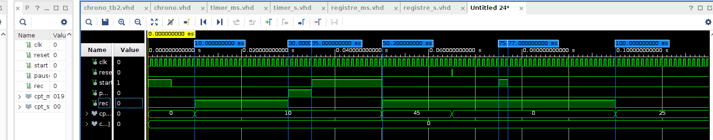
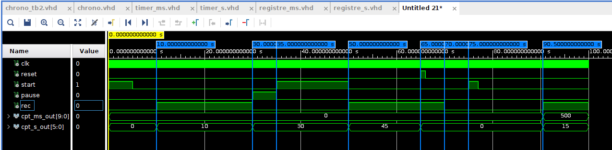

# chronometer_VHDL

Chronomètre simple basé sur deux compteurs, l'un pour les millisecondes (TIMER_MS) et l'autre pour les secondes (TIMER_S). TIMER_MS s'incrémente à chaque milliseconde, tandis que TIMER_S s'incrémente à chaque seconde. Le signal eoc (End Of Count) est égal à 1 à la fin du comptage de TIMER_MS, permettant ainsi le comptage de TIMER_S. Les registres REGISTRE_MS et REGISTRE_S conservent l'état de comptage des deux compteurs. Le fonctionnement global est géré par chrono. 

Entrées 

    Start : Démarre le comptage. 

    Pause : Suspend le comptage sans remise à zéro. 

    Rec : Enregistre l'état de comptage dans REGISTRE_MS et REGISTRE_S. 

    Reset : Remet à zéro tous les composants.
    
 
 resultat du test 1 :
 
 
 
 resultat du test 2 :
 
 
